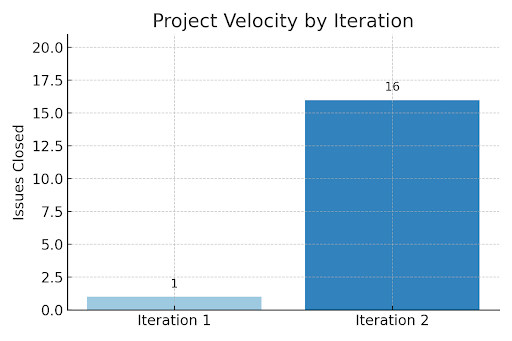

# Team Retrospective
Iteration 3 was the most demanding cycle for us so far. While we delivered a large number of core features such as Notification & Alerts, Appointment Slot Management, Messaging/Chat, Profile Management, Billing & Invoicing, and Receptionist View. This push came with its own set of challenges. Time management, coordination, and code integration were put to the test. Despite the hurdles, this iteration showed what our team is capable of when we divide responsibilities effectively and communicate frequently. The volume of completed work was higher than in previous iterations, but it also exposed weak points in our development process.

The major issue was delayed integration. Although several team members were developing different major features, we frequently drove finished code near the end of the iteration. This introduced late-minute bugs, made testing more difficult, and caused a few merge conflicts. Members of the team had other responsibilities outside of the course which made it challenging to manage who does what and when. Additionally, some sections of our GitLab boards also got out of line with actual developments. Not every task was suitably updated with proper direction and was delayed due to annoying fixes/bugs. Thus, in this large iteration, it was more difficult to monitor who was working on what and for how long. However, as a team, we overcame this issue over a meeting.

Our area of growth lies in our habit of regularly pushing and checking small code modifications using feature branches to keep our workflow realistic and smooth. This lets us catch bugs early and prevent last-minute scrambles. Everyone will be able to remain on the same page because our GitLab sprint board always displays who is in charge of each feature/user story, its estimated length, and its present status. 

Well, we measure our success in the final iteration by concentrating on a few main markers of team performance. For instance, tracking the amount of merge conflicts that arise close to the deadline ideally, there ought to be very little, implying we included our work effectively and gradually. Before the deadline, every important feature will need to be verified by at least one other teammate. Thus, we will check our commit histories and merge request comments to ensure this truly transpired. We would want at least 90% of tasks on our GitLab board to be clearly assigned with precise time estimates and current statuses so everyone knows where things stand. At last, we consider whether we followed our intended check-ins and meetings. If we keep up regular communication and use those times to address roadblocks and track progress, we will count that as a real win for our teamwork!

